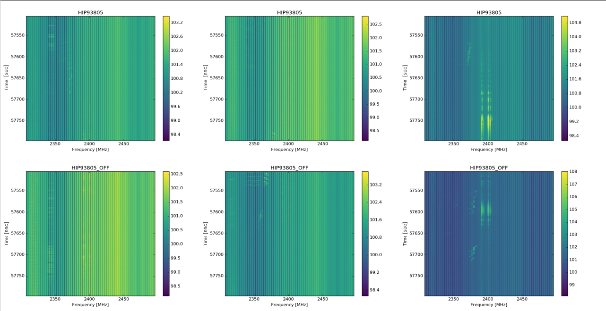
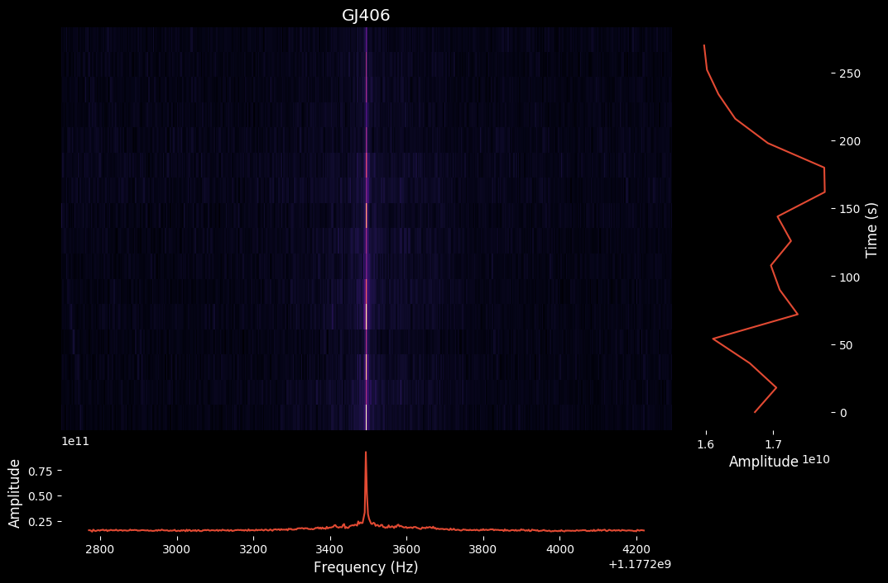
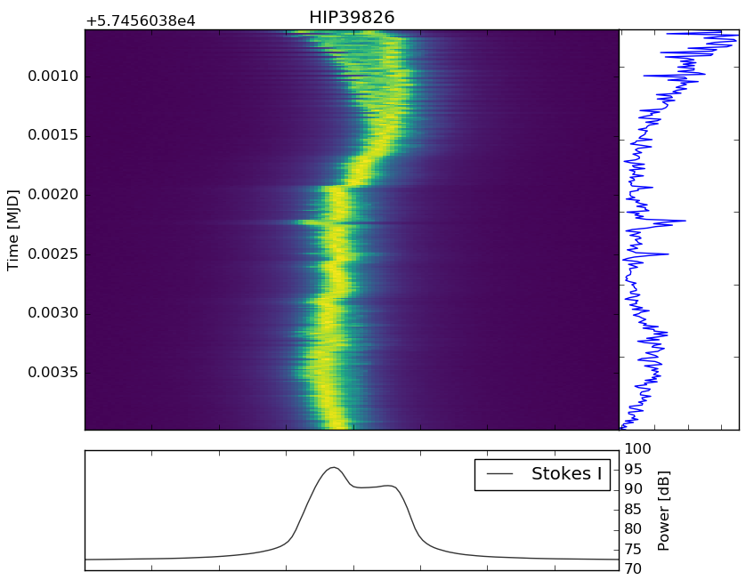
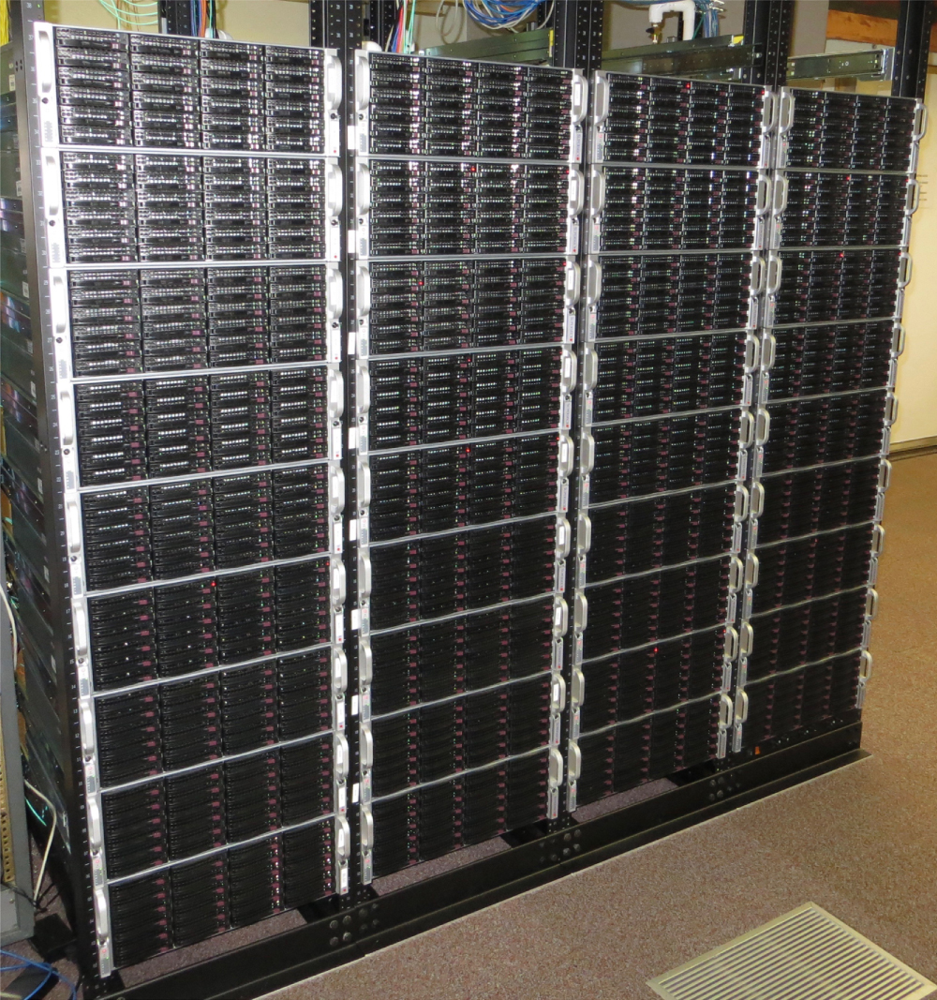
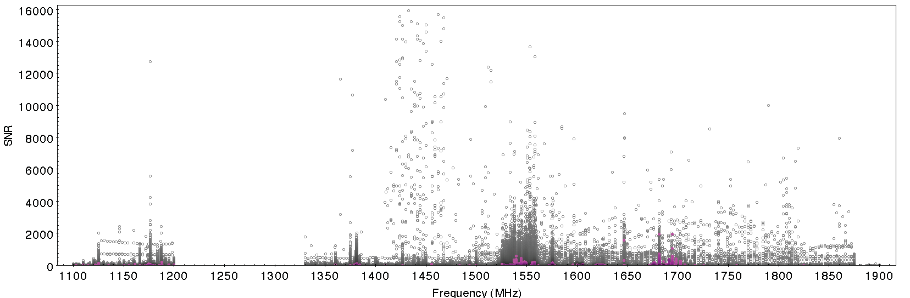
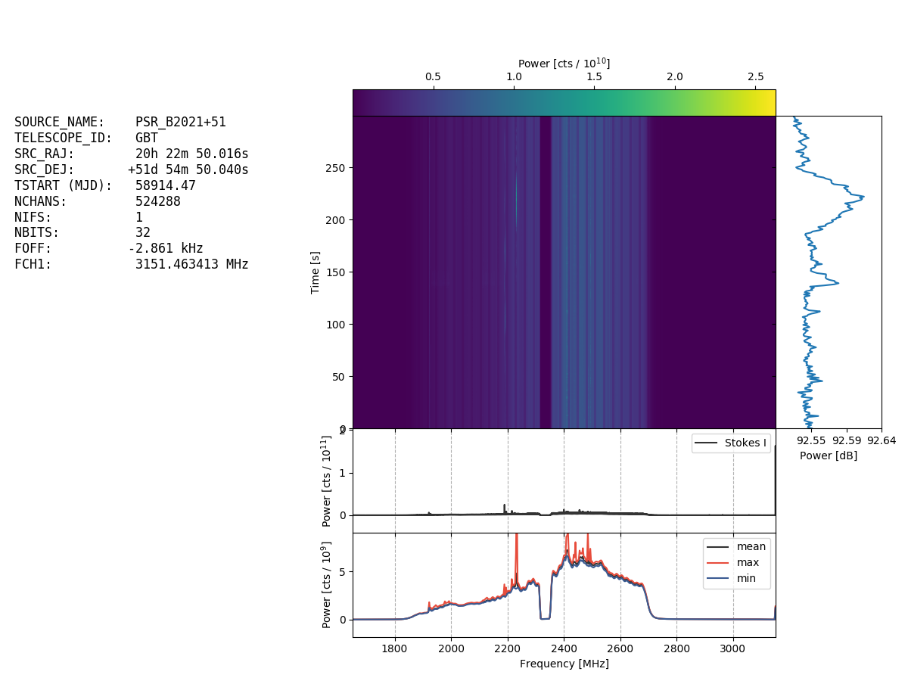

## How to find ET

This README is intended as an introduction to anyone with experience programming in Python who is interested in delving deeper into analysis of data from the Green Bank Telescope. It assumes little or no knowledge of radio astronomy or of techniques used in the search for extraterrestrial intelligence. Intended audiences include those who may be interested in running machine learning or other sophisticated analyses on Breakthrough Listen data.

First, if you haven't already read the five-page introduction on our webpage, please visit seti.berkeley.edu/listen (you can gloss over the parts about optical SETI and the Automated Planet Finder on page 3, and on the second halves of pages 4 and 5). We're going to concentrate on radio searches here, specifically those that we're doing with the 100-meter diameter Green Bank Telescope (GBT) in West Virginia - the largest fully-steerable radio telescope on the planet. When you're comfortable with the material on seti.berkeley.edu, come back here and we'll get into more of the details.

As noted in the introductory materials, the basics of searching for signatures of extraterrestrial technology are actually quite simple, but the confounding factors are:
1. Human technology gives off signals like the ones we are looking for (radio frequency interference)
2. Data volumes are too large to run brute force analysis on the whole dataset

Here's how we deal with these problems:

### Radio Frequency Interference

RFI is emitted by our own transmitters - not just radio stations, but wifi routers, cellphones, and even electronics that are not deliberately designed to transmit radio signals. So searching for extra-terrestrial intelligence (ETI) signals, also known as "technosignatures", is very much a needle in a haystack problem. There are three main methods that we can use to weed out signals of interest.

#### 1. The source is localized on the sky

Our basic observing strategy at GBT is:
* Observe a target ("star A") from our primary target list for 5 minutes
* Observe another target ("star B") at a nearby position on the sky for 5 minutes
* Return to star A for 5 minutes
* Observe another target ("star C") from our secondary list for 5 minutes
* Another 5 minutes on star A
* 5 minutes on another secondary target ("star D")

We repeat this ABACAD cadence for all of the "A" stars in our [primary target list](https://arxiv.org/pdf/1701.06227.pdf) (around 1700 in total, although not all of these are visible from the Green Bank Telescope site).

A signal would be interesting from a SETI standpoint if it's present in all three "A" (or ON primary source) observations, but absent in the "B/C/D" (or OFF primary source) observations. If someone was standing near the telescope with a cellphone switched on, we wouldn't expect this interference to come and go as we move on and off the primary target on the sky, so this is a good way of ruling out the local interference that makes up the majority of RFI.

*Three pairs of on-off waterfall plots for a particular source (the "A" source HIP 93805 on the top row, and the corresponding off-source positions on the bottom row). Here we are just showing the output of one compute node, representing 1/8 of the total bandwidth recorded. Various RFI signals with complex frequency-time structure are seen in all six waterfall plots. If we saw some signal that appeared to be uniquely present in just the top row, and was absent in the bottom row (and perhaps also in all other stars in our primary sample) this would be of interest for follow-up. The two bright vertical signals around 2400 MHz that can be seen most clearly in the two plots in the right column are an example of a signal appearing in both on and off observations, and hence very likely local to the telescope. This may well be a  wifi signal (perhaps from a visitor to the GBT who neglected to put their phone in airplane mode).*

But what about satellites? Our instruments record a huge number of "hits" across the observing band. Many are seen at frequencies around 1575 MHz; these correspond to transmissions from the fleet of GPS satellites orbiting the Earth. However, satellites are not fixed in position relative to the stars in the sky, so a given satellite won't be present just in ON observations but absent in OFF. This is true even for geostationary satellites like DirecTV, which remain fixed in position as viewed by an observer on the ground, but which move relative to the "fixed" stars as the satellites orbit the Earth once per day.

Of course, even if we see a signal in all three ON observations that's absent in the OFFs, this is not a convincing technosignature. We would still want to make follow-up observations of the star to see if the signal persists, and if it does, to notify independent teams using different telescopes to see if they can reproduce the result.

#### 2. The source is narrow band but drifts in frequency

The next method we can use to distinguish between candidate technosignatures and local interference is to see if the frequency of an observed signal is changing with time. The familiar change in frequency of a police siren as the vehicle passes you is due to the Doppler effect, which relates the frequency of a light or sound wave to its velocity relative to the observer. A change in relative velocity (i.e. an acceleration) will produce a signal that changes in frequency as a function of time.

*A waterfall plot showing a signal that is roughly constant in frequency over a 300-second observation. The vast majority of such signals are RFI.*

Imagine a transmitter located near the GBT that is emitting a narrow-band radio signal at a constant frequency of 1500 MHz. In a waterfall plot of frequency versus time (refer back to seti.berkeley.edu/listen if you need a reminder about what this entails) this will be a vertical line - the frequency of the signal remains the same. But for a transmitter that's accelerating relative to the GBT, the signal will drift in frequency, and appear as a diagonal line. There's no reason to think that a transmitter on a rotating alien planet, or even one somewhere out in interstellar space, will maintain a constant velocity relative to our telescope on the rotating Earth.

*This graphic shows the Parkes Telescope and GBT on opposite sides of our planet, feeding data back to the data center in UC Berkeley. Meanwhile, hypothetical signals from transmitters on exoplanets transmit signals that are picked up by the telescopes. Whereas a cellphone nearby one of the telescopes would not be accelerating with respect to that telescope (and hence the signal would not exhibit a Doppler drift), real technosignatures would be expected to show a Doppler acceleration (Image credit: Breakthrough Listen / Danielle Futselaar)*

This provides us with another good way of distinguishing between local RFI (not drifting in frequency) and signals of interest (drifting, with frequency changing up to several Hertz every second). This is easiest when the signal is narrow-band (imagine a "portamento" or "glide" performed by a violin player) rather than a more complex or broad-band signal, but is another way to attempt to reject local RFI.

Former Breakthrough Listen undergraduate intern Sofia Sheikh discusses Doppler drift rates in a SETI context in [her paper](https://arxiv.org/pdf/1910.01148.pdf), accompanied by a [non-technical blog post](http://seti.berkeley.edu/blog/doppler/).

#### 3. The source looks nothing like other sources

Although one of the basic assumptions in our search is that ETI technology might give off similar signals to our own transmitters, it's possible that a transmission designed to attract our attention will be deliberately "weird" in some way. One can imagine pulsed signals, signals encoding mathematical patterns, signals with odd frequency behavior or modulation patterns, as well as broad-band signals with unusual characteristics that might be missed by our narrow-band search techniques.

It's a little more difficult to quantify what counts as "interesting" using this method, because so much RFI is picked up by our instruments that we often see things in the data that appear weird in some way. But combined with one or both of the other methods above, this could be a powerful approach, particularly when combined with machine learning techniques.

*A waterfall plot showing a signal that with complicated frequency-time structure as seen over a 300-second observation. We see lots of RFI signals that look like "squiggles" too.*

Those are the three main search techniques we're employing. Now to talk about the second confounding factor we mentioned above, data volumes.

## Data volumes

The raw datastream recorded by our instrumentation at GBT is 750 MB / second per compute node. We currently have 64 compute nodes (rack mounted computers with GPU processors and lots of disks), although the actual number of compute nodes used at any one time (usually between 8 - 64 nodes in multiples of 8) depends on the frequency range of the receiver that's in use. We're observing for 20% of the time on the GBT - almost 5 hours per day. We have 8 PB of storage and 500 TFLOPS of compute at GBT, but we don't have the space to archive hundreds of TB per day of raw data products. Ultimately we want to develop algorithms that will analyze the input data stream in real time, but for now, let's concentrate on the data products that we *do* archive, which amount to an average of approximately 0.9 TB per hour.

*The BL compute rack at GBT (as of July 2017), showing 32 compute nodes in addition to 4 storage nodes. The remaining 32 compute nodes and 4 storage nodes are located in a different part of the observatory.*

We achieve the reduction in file size essentially by averaging in time, or frequency, or both, losing some of the native resolution of the raw data in exchange for manageable file sizes. The resulting files are stored in "filterbank" format (see below for a description of how to read filterbank files, and check out [this deeper introduction to working with filterbank files](filterbank_tutorial/Filterbank%20Tutorial%20(public).ipynb), written by Umran Haji, one of our undergraduate interns). A filterbank file is basically an array of detected signal strength as a function of frequency and time (with some header information attached). There's one of these files in our archive for each five-minute observation of each star. Actually, filterbank files are "spliced" together from data from each of the 8 or more compute nodes used for a given observation, but for many purposes we want to use the spliced files in our analysis.

For different kinds of analysis, we make different compromises between frequency and resolution, and we store three spliced filterbank files for each observation:

* **High frequency resolution** (~3 Hz frequency resolution, ~18 second sample time)
* **High time resolution** (~366 kHz frequency resolution, ~349 microsecond sample time)
* **Medium resolution** (~3 kHz frequency resolution, ~1 second sample time)

The high frequency resolution files are most like a "traditional" SETI data product, having sufficient frequency resolution to detect a narrow-band signal, and sufficient time resolution to see if the signal has a Doppler drift with time. The total bandwidth is typically measured in GHz, so a high frequency resolution file, for example, consists of a header attached to an array with dimensions of a few hundred million (frequency) by 16 (time). The signal strength at each frequency and time is recorded as a 32-bit float. So individual filterbank files are typically several GB or tens of GB in size.

Such file sizes don't present a major challenge for simpler algorithms, but sophisticated algorithms such as a Doppler drift search or machine learning approaches struggle to deal with the data volumes. We also currently don't have the storage space or network resources to make our whole archive (several PB / year) easily accessible to the algorithms we want to run. Ultimately we would like the data to be in cloud storage with some sort of distributed processing such as Spark to run the analysis. If you have resources that could be donated to help with this goal, please let us know!

You can read a lot more technical details of the file formats, data processing pipeline, and data archive in [Matt Lebofsky's paper](https://arxiv.org/pdf/1906.07391.pdf).

## So how do we find ET?

Here are some basic techniques:

### Energy detection

Start with the high frequency resolution (3 Hz) product, or the medium resolution (3 kHz) product. Optionally (to speed up and / or simplify processing), average all the time samples to get a single 1-dimensional spectrum per 5 minute observation, as opposed to a 2-dimensional spectrogram that preserves both frequency and time samples.

Determine the rms noise, which gives a measure of the sensitivity of the observations. This ought to be measured in channels that are free of RFI (so an algorithm like median absolute deviation, or alternatively an iterative sigma clipping approach might be a more robust estimator in the presence of many channels affected by RFI).

Look for emission above some multiple of the rms noise. You want to set the threshold fairly high - with billions of samples, you'd expect to see six sigma events crop up regularly, even without assuming that: (1) the noise is perfectly Gaussian (it's not), and (2) you've measured the rms correctly. Stick to 10 sigma at a minimum, or higher if you want fewer hits. Make a note of the hits in a database (we're using mySQL) along with metadata such as the Z-score (number of standard deviations above the mean), also referred to as the signal-to-noise ratio (SNR). Now you have a list of frequencies and times (or just frequencies, if you averaged over the time dimension) with detected emission. Depending on how much frequency and time averaging you did, and the SNR threshold you chose, this could be a few hits per file, or a few million. Either way, the expectation is that most of these thresholded hits will be RFI. But maybe there's a technosignature hiding in there. How can we tease it out?

*Plot of thresholded hits for 701 stars from the primary sample as observed by GBT at L-band. Signal-to-noise ratio of each hit is plotted as a function of frequency. No hits are seen between 1.2 and 1.33 GHz due to the "notch filter" which excludes this region of the band due to particularly bad contamination by RFI (particularly at "bad" frequencies such as the GPS band around 1575 MHz). Clearly there are very many channels with emission visible at thousands of times the noise level, and we expect almost all of these to be due to RFI. The points plotted in magenta are those seen in one of the 701 stars; the grey points show the entire sample of 701.*

One way is to use the RFI discriminators discussed above. For example, look for a particular channel that is above the SNR threshold only for the three observations of a particular A star, and not for the corresponding B/C/D observations. You can subtract the 1D or 2D arrays from each other (e.g. A1-B, A2-C, A3-D) to try to get rid of RFI that is stable in frequency and time. Alternatively you can look for channels that are only above threshold for the three A observations, and not above threshold in *any* other star (any A, B, C, or D observation) from our GBT sample.

It's also important to note that there are a number of features present in the data that come from the receiver and the instrument (i.e. not from the radio waves coming from the sky). Most importantly the power as a function of frequency depends on the instrumental bandpass (the sensitivity of the receiver as a function of frequency), as well as the bandpass imposed by the Breakthrough Listen instrument as it splits the data into coarse channels (each 2.92 MHz wide). There's a lot more detail about this in [Matt's paper](https://arxiv.org/pdf/1906.07391.pdf), particularly Fig. 10. Note also that each coarse channel is split into fine channels, and the fine channel at the center of each coarse channel contains a spike which should be removed.

*Plot (made with [blimpy](https://github.com/UCBerkeleySETI/blimpy)) of an observation of a pulsar with GBT at S-band. The main image shows the intensity of the recorded signal as a function of time (vertical axis) and frequency (horizontal access). Regularly-spaced vertical stripes visible in the image are from the 2.92 MHz coarse channelization. The bottom panel collapses the time axis, showing the minimum, mean, and maximum of the data array, as a function of frequency. The overall bandpass shape is clearly visible, including the notch filter (used to reject bright, persistent RFI) at 2300-2360 MHz. The red (max) line is influenced by transient RFI that appears for brief periods of time at particular frequencies.*

You can partially correct for the shape of the instrumental bandpass by doing an "on minus off over off" (subtracting an off file from an on file, and dividing by the off file, e.g. (A1 - B) / B)). Alternatively you can try fitting the bandpass shape. There are various ways of doing this - one method by intern Umran Haji is [here](filterbank_tutorial/Fitting%20Coarse%20Filterbank%20Files%20via%20Data%20Transformation%20%2B%20Splines%20and%20Fourier%20Series.ipynb). Another method by intern Yuhong Chen is [here](https://github.com/FX196/SETI-Energy-Detection/blob/master/Bandpass%20Removal.ipynb). Yuhong is also [developing code](https://github.com/FX196/SETI-Energy-Detection) that is designed to detect signals of interest in the 2D spectrogram data.

If you are analyzing the 3 kHz data, this will reduce the measured SNR of a signal that's significantly narrower bandwidth than 3 kHz (since you are averaging not just over the signal, but neighboring frequencies that are filled with noise). However, it does makes things somewhat simpler in that a signal that's drifting by a few Hz / second won't drift completely out of the channel during a five minute observation.

If you are using the 3 Hz data, you'll get better SNR, but recall from the discussion above that we expect a technosignature to be in an accelerating frame of reference relative to the telescope, so it will drift across frequency channels during the observation. This brings us to the second search method.

## Doppler drift search

A narrow band signal that's drifting in frequency will have some drift rate in Hz / second that can be measured by looking for diagonal lines in a waterfall plot (the spectrogram of the 2D array of frequency-time data). But since we don't know the acceleration of the ETI transmitter, we don't know the slope of this line, and we have to search through a variety of potential Doppler drift rates and find the one that maximizes the SNR of the detected signal. We've developed some code to do this with the Breakthrough Listen data called turboSETI (see below).

A Doppler drift search is more compute intensive but more sophisticated than the thresholded hits analysis, because it's intrinsically more robust against RFI. Whereas we typically get thousands of thresholded hits per observation of a star (depending on the minimum Z-score threshold chosen), only a handful of these will be well fit by a non-zero Doppler drift. In other words, most RFI is either constant in frequency, or appears as a "squiggle", rather than looking like a diagonal line in a waterfall plot.

Of course, there may be "chirped" signals that intrinsically drift in frequency, even if the signals originate close to the telescope, but these are much rarer than non-drifting RFI, and we can also apply the ON-OFF test noted above to identify candidate signals that are only present at a particular position on the sky.

## Machine learning

We're just getting started with this approach, but there are a couple of promising avenues that we are exploring. The filterbank data are arrays of frequency versus time, so algorithms designed for finding features in images might be applicable here. The array sizes are large, but perhaps we can do some binning, or only analyze small subsets of the arrays around regions of interest (e.g. regions surrounding the thresholded hits).

Can we characterize RFI through a clustering analysis or similar, finding RFI that looks similar (e.g. the wide-band pulsed signals from GPS), and then look for outliers in this distribution? Are any of those outliers clustered at particular positions on the sky?

Alternatively can we label RFI signals, either manually or using metadata (e.g. the ON or OFF positions) and use this as a training set? In 2016, we had a machine learning workshop at Berkeley where some experts from JPL and elsewhere tried running clustering analysis and deep learning algorithms on our data. This was quite promising, but we need people with ML expertise who can invest significant amounts of time in pushing this forward.

## How to get started

If you are interested in helping with this effort, here's some background information to get you started.

### How to get access to the data

Some, but not all, of the data are available in the BL archive at http://seti.berkeley.edu/opendata

To access GBT data, select "BL at Green Bank" from the projects drop-down, and optionally a target name. Note that this will return large numbers of files with filetype listed as "baseband data". These are the raw voltage files. Until you already have extensive experience using filterbank files, it would be best to avoid these baseband files at first, and stick to some of the example filterbank files (those with a .fil extension) at http://setiathome.berkeley.edu/~mattl/ml/

If you are developing pipelines to compare features between filterbank files, you may wish to test these with a larger set of data. We've made a subsample of the filterbank files from our analysis in [Enriquez et al. (2017)](http://blpd0.ssl.berkeley.edu/lband2017/Lband_BL_SETI_Submitted_Draft.pdf) available at http://blpd0.ssl.berkeley.edu/Lband/ - there's a total of 16 TB of high frequency resolution filterbanks here. We recommend only downloading these if you have fully explored a smaller subset of the filterbank data. We can provide more filterbank data where these came from on request, and will be making more of the data available online in due course.

### How to read in a filterbank file

As noted above, the file format is pretty simple, a header plus a data array. We are moving towards HDF5 for data storage, which, among other things, makes it easier to access portions of a file without reading the whole thing into memory. You can read both filterbank and HDF5 files using https://github.com/UCBerkeleySETI/blimpy

There's also a fun Jupyter notebook that uses blimpy to read in and display one of our observations of the Voyager I spacecraft. Despite being 20 million kilometers from Earth and having a transmitter that only uses the same power as a refrigerator light, it's clearly detectable by our observations: https://github.com/UCBerkeleySETI/breakthrough/blob/master/GBT/voyager/voyager.ipynb

This is a nice illustration of the capabilities of our instruments to detect signatures of technology even for very distant targets, and observations like the ones of Voyager, or others with artificially inserted "birdie" signals, could be used as a training set for machine learning or other approaches.

### How to analyze thresholded hits

We have some code which will determine thresholded hits from an input filterbank file, store the results in a mySQL database, and then allow the user to query the database for signals of interest and display the results via a web interface. This code is still under active development but please let us know if you would like access as a beta tester or developer. When it's ready, we'll put it on github.

### How to perform a Doppler drift search

Two papers have been published on narrowband Doppler drift searches on Breakthrough listen data. [Enriquez et al. (2017)](http://seti.berkeley.edu/lband2017/) outlines the Doppler drift search technique, and reports technosignature limits for 692 stars at frequencies from 1.1 - 1.9 GHz from GBT. The code used to perform this search can be obtained at https://github.com/UCBerkeleySETI/turbo_seti - it's also still under active development as part of our search pipeline. In a Python environment you should be able to install it with `pip install turboSETI`.

[Price et al. (2019)](http://seti.berkeley.edu/listen2019/) analyzed 1327 stars from GBT and Parkes datasets. As well as the code, the data files for both of these searches are publicly available.

### How to apply ML to BL data

The presentations from our 2016 Breakthrough Listen machine learning workshop are online here: https://github.com/UCBerkeleySETI/blml/tree/master/presentations

You can also browse some badly-organized code from this one-day workshop at https://github.com/UCBerkeleySETI/blml

More recently, a graduate student and a handful of undergraduate interns working with our group have had a crack at ML analysis on GBT SETI data (see https://github.com/UCBerkeleySETI/breakthrough/tree/master/ML). One such analysis used an earlier dataset from GBT that, rather than consisting of pointed ON-OFF observations consists of raster scans across the sky. This introduces some idiosyncrasies that do not apply to the BL dataset, but the analysis may still prove informative. Documentation is available at https://github.com/UCBerkeleySETI/blml/blob/master/presentations/BLMLWorkshop.IShivvers.pdf and code at https://github.com/UCBerkeleySETI/breakthrough/blob/master/ML/kepler-analysis/analysis.ipynb

Our interns have also tried some preliminary analyses on BL data, but there are still many very promising avenues to explore in this area. [Here's a video](https://youtu.be/iENGPqNoFBY) two of our interns produced describing their approach.

#### Background reading

In addition to the Python links above (particularly the filterbank reader and ML code), the following may be useful:
* AstroPy - a Python library for astronomy: http://www.astropy.org/ - particularly of relevance here are:
  * [Representing and converting between astronomical coordinate systems](http://docs.astropy.org/en/stable/coordinates/index.html)
  * [Manipulating times and dates](http://docs.astropy.org/en/stable/time/index.html)

Material on RFI mitigation:
* AOFlagger - code to flag RFI (which would likely remove most ETI signals too!) including links to a journal article: https://sourceforge.net/p/aoflagger/wiki/Home/
* RFI mitigation using deep convolutional neural networks: https://arxiv.org/pdf/1609.09077.pdf
* Code related to the above paper: https://github.com/jakeret/tf_unet

Some more machine learning papers that may be of interest, not directly related to BL or our data, but maybe relevant:
* Outlier detection on galaxy images, based on unsupervised Random Forest: https://arxiv.org/pdf/1611.07526.pdf
* Feature extraction in galaxy images using generative adversarial networks: https://arxiv.org/pdf/1702.00403.pdf

Radio astronomy tutorials (more in depth than you'll need, but good for reference):
* Interferometry and Synthesis in Radio Astronomy (free ebook): https://link.springer.com/book/10.1007%2F978-3-319-44431-4
* Lecture notes from the Essential Radio Astronomy course by Condon and Ransom (now also available as a texbook): http://www.cv.nrao.edu/course/astr534/ERA_old.shtml

## Summary

The search for extraterrestrial intelligence attempts to answer one of humanity's oldest questions: Are we alone in the Universe? Breakthrough Listen's program of public code and data seeks to engage the world in this quest. The long-sought signal may in fact already be hiding in our publicly-available dataset, and you may have the skills to help us find it.

We welcome those with technical skills in signal processing, machine learning, and related areas to help us in our goal of removing the haystack of RFI while not throwing away the needle, the technosignature for which we search. While we don't have the resources to provide personalized support to those who are just getting started with learning Python or data processing, if you make some progress with our data using modern analytics tools, we'd love to hear from you at bsrc@berkeley.edu.

*Steve Croft, March 2019*
